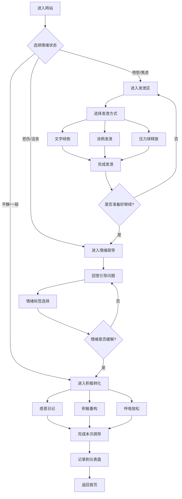

## 1. 产品概述

一个纯前端的情绪疏导网站，帮助用户安全地发泄负面情绪、理清思绪，最终找回内心的平静与快乐。

- **核心目标**：为用户提供私密、安全的情绪宣泄空间，通过互动引导帮助用户完成情绪释放→理性思考→积极转化的完整心理疏导流程
- **目标用户**：面临压力、焦虑、愤怒或情绪困扰的普通人群
- **产品价值**：零门槛、随时随地可用的情绪自助工具，无需注册登录，完全本地运行保护隐私

## 2. 核心功能

### 2.1 功能模块

1. **情绪发泄区**：提供多种发泄方式（文字倾倒、涂鸦画布、压力球点击）
2. **情绪梳理引导**：通过问答式对话引导用户理清情绪根源
3. **积极转化练习**：感恩日记、积极重构、呼吸放松等正向练习
4. **情绪仪表盘**：可视化展示用户的情绪变化轨迹（本地存储）

### 2.2 页面详情

| 页面名称 | 模块名称 | 功能描述 |
|---------|---------|---------|
| 情绪发泄页 | 文字倾倒区 | 用户自由输入情绪文字，支持"撕碎"动画删除 |
| 情绪发泄页 | 涂鸦画布 | 自由绘画发泄，支持清空重画、颜色选择 |
| 情绪发泄页 | 虚拟压力球 | 可点击/拖拽的弹性球体，点击时产生形变动画和计数 |
| 情绪梳理页 | 引导式对话 | 渐进式问题卡片，引导用户思考"为什么生气"→"能改变什么"→"该怎么做" |
| 情绪梳理页 | 情绪标签选择 | 让用户选择当前情绪类型（愤怒/悲伤/焦虑/沮丧等） |
| 积极转化页 | 感恩日记 | 引导用户写下3件值得感恩的事，支持本地保存 |
| 积极转化页 | 积极重构练习 | 帮助用户将负面想法转化为积极视角 |
| 积极转化页 | 呼吸放松引导 | 4-7-8呼吸法动画引导，带动画节奏提示 |
| 仪表盘页 | 情绪趋势图 | 基于localStorage的情绪历史记录可视化 |
| 仪表盘页 | 成就系统 | 展示用户完成的情绪疏导次数和连续天数 |

## 3. 核心流程



## 4. 用户界面设计

### 4.1 设计风格

- **色彩主题**：温暖的渐变色调
  - 主色调：柔和的日落橙 (#FF8C66) 到宁静蓝 (#6BA3BE) 的渐变
  - 辅助色：温暖的米白 (#FFF8F0)、淡紫色 (#D4A5FF)
  - 情绪色：愤怒用深红、悲伤用靛蓝、焦虑用明黄、平静用薄荷绿
- **按钮风格**：圆润的胶囊形按钮，带有轻微的悬浮效果和点击反馈
- **字体选择**：
  - 标题使用圆润友好的字体（如"Nunito"或"Quicksand"）
  - 正文使用清晰易读的字体（如"Source Sans 3"）
- **布局风格**：卡片式设计，大量留白，居中对齐，营造安全感和呼吸感
- **图标风格**：简约线性图标，配合柔和的圆角和微妙的阴影

### 4.2 页面设计概述

| 页面名称 | 模块名称 | UI元素 |
|---------|---------|--------|
| 情绪发泄页 | 文字倾倒区 | 大面积文本框，半透明背景，"撕碎"动画按钮 |
| 情绪发泄页 | 涂鸦画布 | 全屏画布，底部工具栏（颜色选择、画笔大小、清空按钮） |
| 情绪发泄页 | 虚拟压力球 | 居中弹性球体，点击时产生形变，顶部显示点击计数 |
| 情绪梳理页 | 引导式对话 | 居中对话卡片，淡入淡出动画，进度指示器 |
| 积极转化页 | 呼吸放松 | 圆形呼吸动画（扩张-保持-收缩），文字提示节奏 |
| 仪表盘页 | 情绪趋势图 | 折线图展示情绪变化，本地存储数据 |

### 4.3 响应式设计

- **桌面优先设计**：桌面端采用居中卡片布局，最大宽度1200px
- **移动端适配**：移动端改为全宽卡片，触控友好的按钮尺寸（最小44px）
- **过渡动画**：页面切换使用淡入淡出动画，交互元素有微妙的悬浮和点击反馈

### 4.4 视觉与动效指导

- **背景效果**：柔和的渐变背景，带有轻微的噪点纹理增加质感
- **动画原则**：
  - 页面加载：元素从下方淡入，带有轻微的延迟错位效果
  - 交互反馈：按钮点击有缩放和颜色变化，卡片悬停有上浮效果
  - 情绪过渡：从发泄到疏导到转化，背景色从暖红渐变到平静蓝绿
- **微交互**：
  - 压力球点击时的弹性形变动画
  - 文字撕碎时的碎片飘落效果
  - 呼吸动画的平滑扩张收缩

## 5. 数据存储

### 5.1 本地存储方案

- **技术方案**：使用浏览器 localStorage 存储用户数据
- **存储内容**：情绪记录、感恩日记条目、疏导完成次数、连续天数
- **隐私保护**：所有数据仅存储在用户本地，不上传服务器
- **数据清理**：提供"清除所有数据"选项

### 5.2 数据结构

```json
{
  "moodHistory": [
    {
      "date": "2024-01-15",
      "initialMood": "愤怒",
      "finalMood": "平静",
      "activities": ["文字倾倒", "呼吸放松"],
      "timestamp": 1705312800000
    }
  ],
  "gratitudeJournal": [
    {
      "date": "2024-01-15",
      "items": ["健康的身体", "朋友的支持", "美味的午餐"]
    }
  ],
  "stats": {
    "totalSessions": 12,
    "streakDays": 5,
    "lastSession": "2024-01-15"
  }
}
```

## 6. 功能优先级

### 6.1 第一阶段（核心功能）

- 情绪发泄区（文字倾倒 + 压力球）
- 基础情绪梳理引导
- 呼吸放松动画

### 6.2 第二阶段（完整功能）

- 涂鸦画布发泄
- 感恩日记
- 积极重构练习
- 情绪仪表盘

### 6.3 第三阶段（增强功能）

- 更多发泄方式（语音呐喊、捏泡泡纸等）
- 个性化疏导路径
- 导出数据功能
